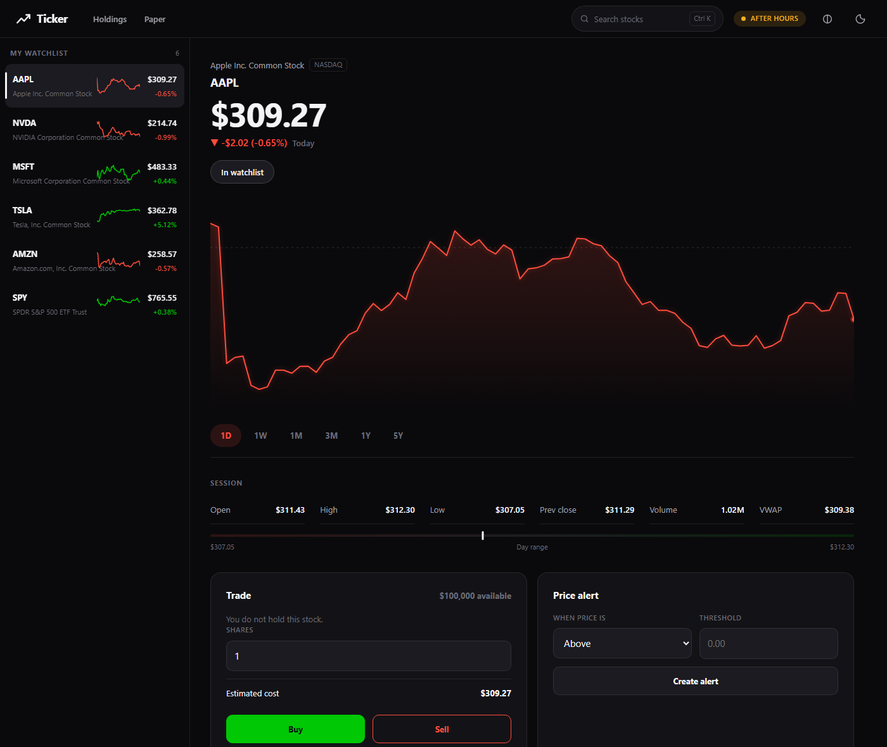
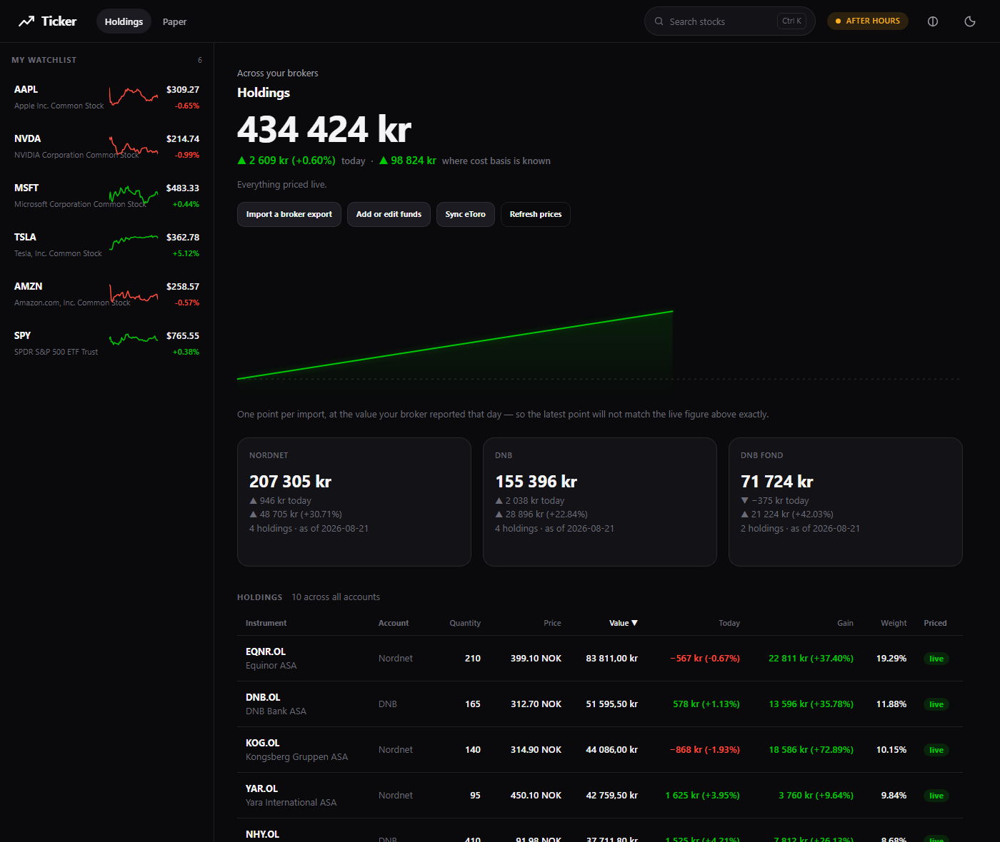

# Ticker

A stock watcher with a Robinhood-style interface: live watchlists, scrubable
price charts, and a paper portfolio that never touches a broker.

Java 17 · Javalin 7 · PostgreSQL · Alpaca market data · a vanilla-JS front end
with no build step.



## What it does

- **Watchlists** — a rail of symbols with live prices, percent moves and a
  sparkline per row. The whole rail refreshes in a single API call.
- **Charts** — 1D / 1W / 1M / 3M / 1Y / 5Y. Drag across the chart (or use the
  arrow keys) and the price, change and timestamp in the header follow your
  cursor. The 1D baseline is the previous session's close, drawn as a dashed
  line, exactly like the app it borrows from.
- **Search** — `Ctrl-K` opens a command palette over all ~14,700 US equities,
  ranked so an exact ticker beats a prefix, which beats a company-name match.
- **Paper portfolio** — virtual cash, simulated buys and sells at the last
  trade price, positions with average cost and realised/unrealised P&L, and a
  portfolio value curve rebuilt from your trade log.
- **Price alerts** — one-shot above/below thresholds, evaluated every minute.
- **Themes** — dark and light, plus a colour-blind-safe palette that swaps
  green/red for blue/orange.

Everything is local. No order ever reaches a broker.

## Holdings — your real brokers, in one NOK total




*Both screenshots use invented holdings — the figures are not anyone's real
portfolio. Market prices in them are genuine.*

Separate from the paper portfolio, and deliberately so: mixing simulated money
into a real net-worth figure is not something to do by accident.

Drop in an export and it becomes one combined total:

| Broker | How | Identified by |
|---|---|---|
| **eToro** | **live API** — no export needed | eToro instrument id |
| **Nordnet** | *Aksjelister* (`.csv`) | name — no ISIN, no ticker |
| **DNB** | holdings report (`.xlsx`) | ticker, or name |

DNB emits two different holdings workbooks and both are read: the Norwegian
one, with an `Aksjer` sheet keyed by ticker and a `Total` sheet to reconcile
against, and `DNBBeholdning.xlsx`, which has English headers and one sheet per
asset class. The second carries an ISIN — the one exact identifier any of these
files offers — but nothing downstream reads it yet, so its rows are matched by
name like Nordnet's.

eToro is the only one of the three offering a personal API. Add
`ETORO_API_KEY` and `ETORO_USER_KEY` to `.env` (Settings → Trading → API Key
Management, Read permission) and a **Sync eToro** button appears. Its holdings
are valued by eToro rather than re-priced here — an eToro account can mix plain
shares with leveraged CFDs, shorts and copy portfolios, and only the first is
something a share price could value. Leverage and short positions are labelled
in the table rather than shown as though they were ordinary stock.

- **Live pricing where it exists.** Oslo Børs and Stockholm listings come from
  Yahoo in their own currency; US equities from Alpaca. Norges Bank supplies the
  NOK rates.
- **Honest where it doesn't.** Norwegian mutual funds have no free price feed,
  so they carry the value your broker last reported, stamped with its date. The
  total says so: *"412 500 kr — 99.9% priced live, 600 kr as of 14 Aug"*.
- **Matches are verified, not guessed.** Neither export carries an ISIN, so an
  instrument is resolved from a name or ticker and then checked against the
  price in your own file. A mismatch is refused and handed to you to fix rather
  than quietly believed — which is what caught a Nordnet line called "AEye A"
  resolving to AudioEye (`AEYE`) when the holding was AEye Inc (`LIDR`).
- **Imports are reversible.** Each one writes a dated snapshot rather than
  editing holdings, so re-importing is safe and a value history builds up for
  free.

Broker exports live in `imports/`, which is gitignored.

## Requirements

| | |
|---|---|
| Java | **17 or newer** (Javalin 7 is compiled for 17) |
| Maven | not required — the repo ships a wrapper |
| PostgreSQL | 12+ |
| Alpaca account | free paper account works; a data subscription unlocks more |

## Setup

**1. Configure**

```bash
cp .env.example .env
```

Fill in your PostgreSQL password and your Alpaca keys from
<https://app.alpaca.markets/paper/dashboard/overview>.

**2. Create the database**

Only an empty database is needed. The app creates and migrates its own tables
on startup.

```bash
createdb -h localhost -p 5433 -U postgres postgres
```

**3. Run**

```bash
.\run.bat
```

The launcher checks your `.env`, finds a JDK 17+, verifies the port is free,
then starts the server. Open <http://localhost:9090>.

Other ways in:

```bash
cd demo && .\mvnw.cmd compile exec:java     # Windows
cd demo && ./mvnw compile exec:java         # Git Bash, WSL, macOS, Linux
.\run.ps1 -Package                          # build demo/target/ticker.jar
```

The first `mvnw` run downloads Apache Maven (~9 MB, SHA-512 verified) into
`~/.m2/wrapper`. After that it is offline and instant.

## How it fits together

```
browser ── /api/* JSON ──▶ Javalin ──▶ services ──▶ PostgreSQL  (what you own:
   │                                       │                     watchlists,
   └─ static files                         └──────▶ Alpaca       trades, bars)
      (no bundler)                                  (prices)
```

- **Quotes and intraday bars** are fetched live and cached in memory for
  15–60 seconds. They are not stored — they go stale in seconds and nothing
  needs them once the chart is drawn.
- **Daily bars** are written to `stock_price`. They power the portfolio value
  curve and act as the offline fallback when Alpaca is unreachable.
- **Your data** — watchlists, trades, positions, alerts — lives only in your
  database.

See [docs/ARCHITECTURE.md](docs/ARCHITECTURE.md) for the full picture,
[docs/API.md](docs/API.md) for the endpoints, and
[docs/DESIGN.md](docs/DESIGN.md) for the interface rules.

## Database

The schema is applied automatically from versioned migrations in
`demo/src/main/resources/db/migration/`. Applied files are recorded in
`schema_migration`; each runs once, in its own transaction.

To change the schema, add the next `V0NN__name.sql` and append its filename to
the `MIGRATIONS` array in `Db.java`. Never edit a migration that has shipped.

## Tests

```bash
cd demo && .\mvnw.cmd test
```

41 tests covering the pure logic: range parsing and lookback windows, quote
arithmetic, sparkline downsampling, daily-job scheduling, request validation,
and timestamp parsing. Anything needing a database or the network is exercised
by running the app, not by a mock.

## Configuration

Every value is read from JVM system properties, then environment variables,
then the nearest `.env` walking up from the working directory, then a default.
See `.env.example` for the full list. Useful ones:

| Variable | Default | Notes |
|---|---|---|
| `SERVER_PORT` | `4567` | `.env.example` suggests `9090` |
| `DATA_FEED` | `sip` | Falls back to `iex` automatically on a 403 |
| `PAPER_STARTING_CASH` | `100000` | Applied only when the portfolio is created |
| `SYNC_ASSETS_ON_START` | `false` | The full asset refresh is tens of MB |
| `QUOTE_CACHE_SECONDS` | `15` | How long a quote is reused |

## Troubleshooting

**`Text Blocks are only available with source level 15 and above`**
A stale `target/` built by an older JDK. Run `cd demo && .\mvnw.cmd clean compile`.
If VS Code keeps recreating it, its Java extension is using an old runtime —
`.vscode/settings.json` now pins a JDK 17+ runtime; reload the window.

**`Alpaca credentials are missing`**
No `.env`, or `API_KEY_ID` / `API_SECRET_KEY` are empty. The app deliberately
refuses to start rather than fail later on the first request.

**Prices show but charts are empty**
Your account is not entitled to the requested feed. The client detects this and
downgrades to `iex` for the rest of the run; the startup log shows the feed in
use. Set `DATA_FEED=iex` to skip the probe.

**`Connection refused` on startup**
PostgreSQL is not running, or `DB_URL` points at the wrong port. Note the
default here is **5433**, not the usual 5432.

**Port already in use**
`run.ps1` reports which process holds it. Change `SERVER_PORT` in `.env` or stop
that process.

## Security

`.env` is gitignored and is the only place credentials belong. Build output and
broker exports are not tracked. The app binds to localhost and has no
authentication, which suits a single-user tool and rules out hosting it as-is.

See [docs/SECURITY.md](docs/SECURITY.md).

## Licence

For educational and personal use.
